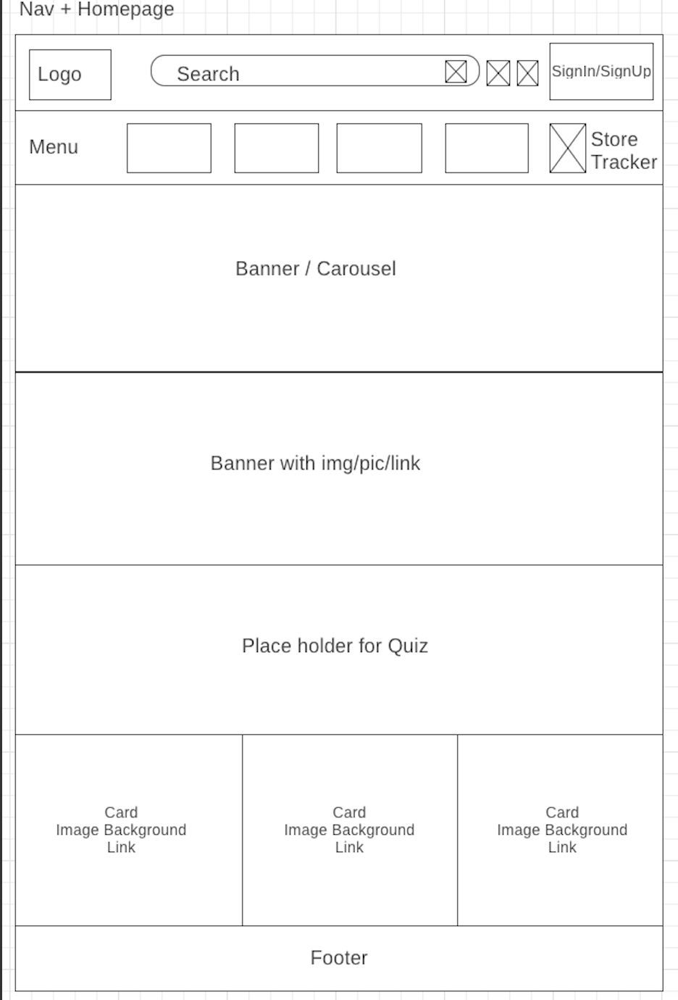
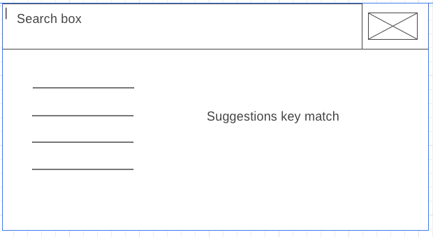
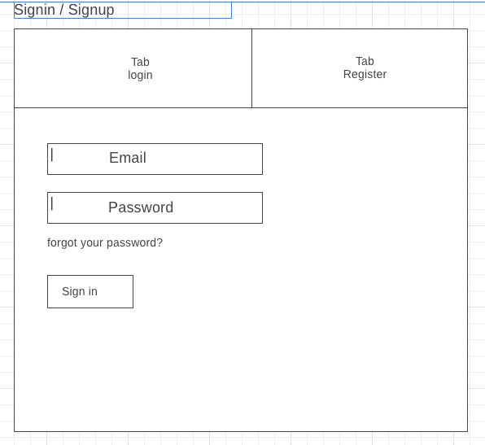
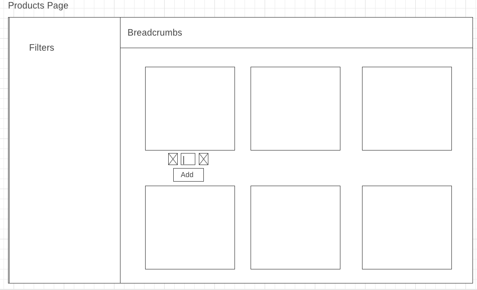
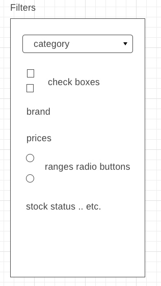
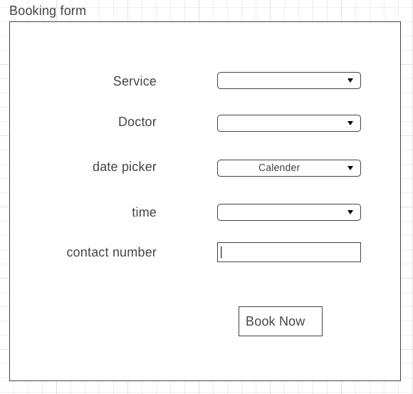
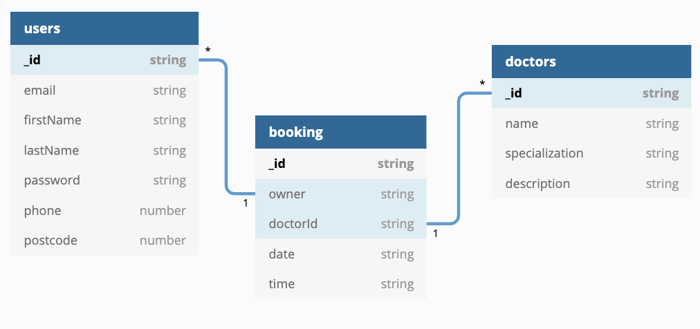

# MERN-React-Express-Application

### Overview:
A one stop site of a medical centre which provides details on about, contact, opening hours, products and services it provides.
The user would have visibility to the services provided and schedule a booking via the App.
App also offer an online chemist channel for easier access to non-prescription products and authenticated shopping carts.

### Planning:
#### User stories
- Authentication: 
    * User would be allowed to see products, services and doctor's details, but would not be able to book until logged in.
    * User would be prompted to login on booking page otherwise.
- User Flow: 
    * User will be able to sign in, sign up and logout. 
    * Once signed in, will be able to book for the preferred doctor, date and time. 
    * User will be able to see the booking on "My Booking" page. User should be able to cancel the booking from "My Booking" page. 
    * A new booking would not be allowed until a previous booking has been cancelled
    * User should be able to go to "Products" page and browser through the different products via filters.
    * User should be able to go to "Services" > "GP" or "Physio" pages and click on specific doctor to see their profile and contact info
    * User should be able to serach via serach box in Nav
    * See also similar results on result page
    * click on product to see more details. Add to cart item button to be available on product page
    * If user adds items to the cart when logged in, user should be able to see them in cart after logging back in. 
    * On logging out, the cart should be clear again. User would be able to checkout the items in the cart and receives successful checkout notificaiton

- Features Wish List:
    * Login, Logout, Register
    * Combination of private and private routes
    * Booking form
    * User My booking page
    * Admin functionality - create, update, delete : products and doctors details on Admin Page
    * Shopping Cart
    * Filters functionality for Products on "Products" & "Search Result"
    * Add to cart functionality on "Products", "Product" & "Search Result"
    * In stock availability status on "Product" and "Cart"
    * Search + Keywords suggestions "Did you mean ... etc."
    * Search Result
    * Store Locator Map
- Nice to have:
    * User Profile
    * Upload image from drive
    * Roster for doctors
    * Booked time-slot validations
    * Quiz/Questionnaire on Homepage
    * Banner / Carousel on Homepage
    * Contact us + Form to trigger email
    * Send Emails on successful checkout, successful booking and booking cancellation
    * Deploy and host

### Wireframes:

### Getting Started:
- Install latest MongoDB Compass
- Install latest Node
- More information on installation and running servers can be found on README files under "medical-centre-app" and "medical-json-api"
- Run both "medical-centre-app" and "medical-json-api"

### Technologies used:
- Backend
    *  mongoose v5.4.6
    *  express 4.16.3
    *  express Session v1.15.6
    *  bcryptjs
    *  jsonwebtoken

- Frontend
    *  React
    *  jwt-decode
    *  moment
    *  material-ui
    *  local storage

### Current Features:
- Backend APIs to support user, doctor, booking, cart, product CRED functionalities
- Error handling and validations in backend APIs
- Basic routes and page setups for planned components
- Show/hide components
- Front end - login, logout, register functionalities in combination of Menu dropdown, Modal and Tabs
- Combination of private and public routes
- Modal triggers to login on Authenticated pages automatically or via button on Nav
- Booking form : Create new booking
- My booking page attached to user login credentials

### Challenges and Improvements:
* **Challenges**:
    * Modal styling: Tabs for "Login" & "Register" were not displaying properly inside the Modal 
    * Error handling in frontend from backend: Was not able to retrieve error message passed from backend. Unable to convert to json format or find via text type. Solution: specified in backend to send json format for error messages instead of plain strings

* Further **Improvements** can be done to:
    * Refactoring
    * Form Validations
    * Add shopping cart flow
    * Filters functionality
    * Search
    * Booked time-slot validations
    * rest of the functionalities from features wish list

